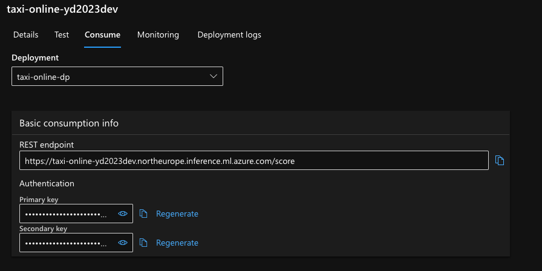

# mlops-v2

> This repository was "forked" from this solution [accelerator](https://github.com/Azure/mlops-v2).

Thinking about MLOps? This repo is a good starting point to get you started with MLOps. The first step is to understand the moving parts of MLOps.
The approach currently leverages few key areas:

- Azure Machine Learning (AML) CLI V2 (az ml) - see our formal docs [here](https://learn.microsoft.com/en-us/azure/machine-learning/how-to-configure-cli?tabs=public)

- DevOps pipeline or GitHub actions

- AML CLI (V2) YAML shcema - see our [docs](https://learn.microsoft.com/en-us/azure/machine-learning/reference-yaml-overview)


## Prerequisites

Cloning or forking this repo.

### 0 - Create Resources


The following command will create a resource group with all required resources. The resource group will be named `rg-amlv2-<prefix>-<postfix>` and the resources will be named `<prefix>-<postfix>-<env>-<resource>`.

Once the repo is cloned you can run the following command to create the resources, alternatively you could use exsiting azure machine learning workspace. 


> this command needs to run from the infrastructure folder

```azurecli
az deployment sub create --name <deployment-name> --location <location-of-the-service> --template-file main.bicep --parameters prefix=ydamlv2 postfix=yd2023 env=dev
```

Note for later use the following values:

- resource_group: `<The resource group of aml>`

- workspace_name: `<Azure machine learning workspace name>`

### 0.1 - CLI Setup / Update

> this commands needs to run from the main folder. it is recomended to keep your az extentions up to date 

```azurecli
set -e # fail on error
python -m pip install -U --force-reinstall pip pip install azure-cli==2.35
az version
az extension add -n ml -y
az extension update -n ml
az extension list

```

### 1 - Connect to the workspace

The following commands connects your current session to the aml workspace created in the previous step, you could connect to an existing workspace as well, provide the name and the resource group of the workspace. Ensure that you are connected to the correct subscription. 

```azurecli

az login
az account set --subscription <subscription id>
az account show
```

```azurecli
az configure --defaults group=<resource group name> workspace=<workspace name>
```

### 2 - Creating / Register an environment

You could create either a docker based environment or a conda based environment.

Lets register an enviorment, run it from the main folder (docker)

```azurecli
az ml environment create --file mlops/azureml/train/train-env.yml

```

We could also use a conda env (not docker) - decide on an approach and leverage it.

```azurecli
az ml environment create --name taxi-train-env --file mlops/azureml/train/train-env.yml
```

### 3 - Create a compute

Now lets create the compute (in case it was not created before) if the cluster is already created you can skip this step (it wont create a second one though)

You can find what compute is already created by running the following command:

```azurecli

az ml compute list
```

Run this to make sure the compute is created:

```azurecli
az ml compute create --name cpu-cluster  --type amlcompute  --size Standard_DS3_v2 --min-instances 0   --max-instances 4   --tier low_priority

```

### 4 - Submit a training job (prep, train, evaluate, model registeration)

Now lets run a training job, submiting the job and then opening the web ui to monitor it. (This would work on mac/linux)


```azurecli

run_id=$(az ml job create -f mlops/azureml/train/pipeline.yml --query name -o tsv)

az ml job show -n $run_id --web
```

For windows, you can use the following __powershell__ command:

```powershell

$run_id = az ml job create -f mlops/azureml/train/pipeline.yml --query name -o tsv  
az ml job show -Name $run_id --web  

```

### 5 - Deploy the model

So, we called a pipeline that perform few activities such as preprocessing, training and registering the model. now the model is registered. The next step would be to deploy an online (not batch) the model. We first create an end-point. you should verify it does not exist before you run this.

```azurecli

az ml online-endpoint create --name taxi-online-yd2023dev -f mlops/azureml/deploy/online/online-endpoint.yml

```

after the endpoint is created we can deploy the model to it. 

```azurecli

az ml online-deployment create --name taxi-online-dp --endpoint taxi-online-yd2023dev -f mlops/azureml/deploy/online/online-deployment.yml

```

after deployment, we need to route the traffic to the new model. 

```azurecli
set -e
az ml online-endpoint update --name taxi-online-yd2023dev --traffic "taxi-online-dp=100"
```

### 6 - Test the model

The scoring code is generated during the training of the model. __TBD: how to get the scoring code.__
lets test it

```cli

az ml online-endpoint invoke -n taxi-online-yd2023dev --deployment-name taxi-online-dp --request-file data/taxi-request.json
```

You could also test it directly from the web ui. 


You could also test it using other platforms, like using the SDK or the rest api. 

In the  web ui, you can acuire the scoring uri and the api key.



Under the folder /tests you can use the `online.rest` file to test the endpoint. Just ensure to fill in the required `.env` file with the scoring endpoint and the api key. 

```env

base_url=<URL of the online/batch end-point>
api_key=<API key>

```

